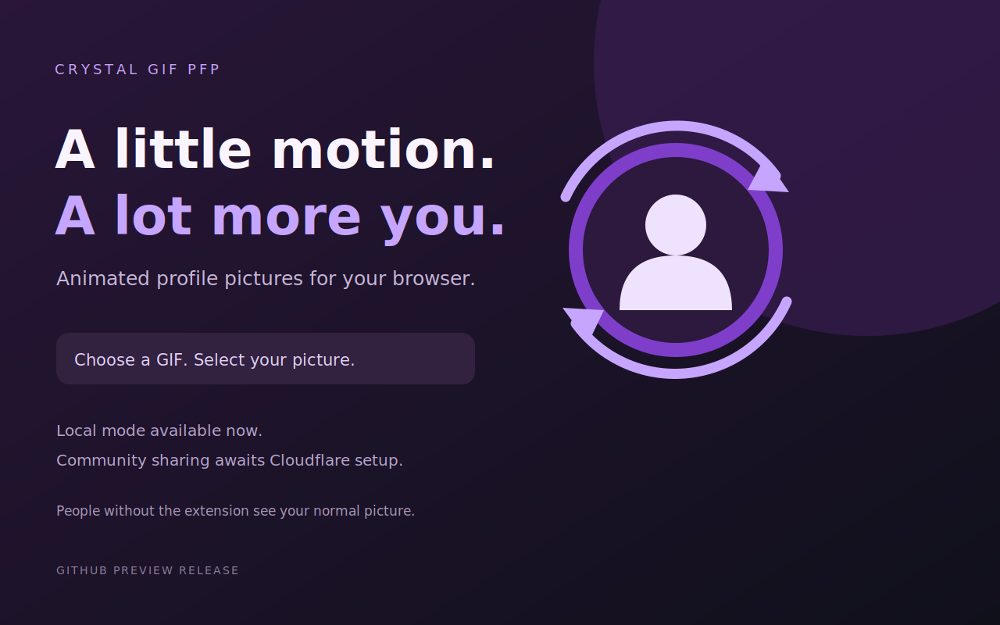

# Crystal GIF PFP

**Your YouTube picture, with a little motion.**

Local animated profile pictures · Optional community sharing · **No channel-description code** · Dark purple UI

[⬇️ Download Crystal GIF PFP](https://github.com/y2kbeatzz-dot/crystal-gif-pfp/archive/refs/heads/main.zip) · [Report an issue](https://github.com/y2kbeatzz-dot/crystal-gif-pfp/issues)

## Current status

**v2.5.1 is live.** Cross-account community viewing is updated for 1 MB shared GIFs, wide YouTube sidebars, and alternate channel layouts. The profile-description verification code is gone, and the shared Cloudflare service is running **Worker v5**. Users can keep a GIF local or publish it for other Crystal users without editing their YouTube channel description.

Server lookup has been verified against the live Worker v5 service. Only people using this extension with **Community pictures** enabled can see published GIFs. Everyone else still sees the normal YouTube picture. Crystal does not change the picture stored on Google's servers.

## Install in Chrome

1. [Download the project ZIP](https://github.com/y2kbeatzz-dot/crystal-gif-pfp/archive/refs/heads/main.zip) and choose **Extract All**.
2. Open `chrome://extensions` and enable **Developer mode**.
3. Click **Load unpacked** and select the extracted **extension** folder (the folder containing `manifest.json`).
4. Refresh YouTube and open Crystal from Chrome's extensions menu.
5. Choose a GIF and use **Select my picture on YouTube** only for the picture you want animated locally.

To update without losing your settings, replace the files in the same extension folder, click **Reload** in `chrome://extensions`, and refresh YouTube. Do not remove the extension first.

## What it does

- Saves a local GIF and restores it as YouTube changes videos or pages.
- Lets viewers opt into shared community GIFs.
- Connects a publishing channel by automatically reading the signed-in YouTube account avatar and matching it with the public avatar for the handle you enter.
- Publishes one GIF per connected channel, with deletion, blocking, reporting, and operator removal tools.
- Matches shared GIFs by the YouTube channel reference, so different avatar CDN sizes/URLs on different accounts no longer break community viewing.
- Includes a GIF readiness checker and optimizer/resize/convert tools in the popup.
- Does **not** require a verification string in your bio/channel description.

A shared GIF must be a real GIF file, at most **1 MB**, and **512 × 512 pixels** or smaller. Local GIFs can be up to **5 MB**. v2.5.1 raises the community file-size limit to **1 MB** while keeping the **512 × 512 px** dimension cap, and fixes the viewer download limit so other Crystal users can actually display GIFs larger than 512 KB. It includes a share-readiness checker plus quick links to optimize, resize, or convert GIFs before publishing.

## Share your GIF — no profile code

1. Sign into the YouTube channel you want to use.
2. Choose your GIF in Crystal.
3. Enter your YouTube `@handle`, confirm you have permission to share the GIF, and click **Share my GIF with the community**. Crystal automatically reads the signed-in account avatar.
4. Turn on **See other members' GIFs** to view community pictures too.

That's it. There is no description code to copy, paste, save, or remove.

Publishing is public to Crystal users. Use **Delete shared profile** to remove your shared record. Uninstalling the extension alone does not delete a published profile.

## How the no-code connection works

The extension automatically reads and normalizes the image address of the signed-in top-right YouTube avatar. The Cloudflare service resolves the `@handle` you entered with the YouTube Data API and compares its current public avatar key. A connection is issued only when those avatar keys match.

This is intentionally a lightweight convenience check, **not Google OAuth and not cryptographic proof of channel ownership**. It avoids putting junk text in a channel profile while still preventing ordinary accidental handle mix-ups. Do not treat it as high-security authentication.

## Privacy

Local mode keeps the GIF and selected image key in Chrome storage. Shared mode sends visible channel IDs/handles for lookups. Publishing stores the GIF, public channel ID, handle, title, public avatar key, timestamps, and a hashed management token. Full video URLs, video titles, comments, and watch history are not sent to the service.

Connected profiles expire after **180 days** unless refreshed by publishing again. See [the privacy policy](extension/privacy.html).

## Check that community sharing works

1. In your main Chrome profile, install/reload v2.5.1, sign into the channel, choose a small looping GIF, enter your handle, and publish.
2. Create a second Chrome profile and install the same extension there. Enable **See other members' GIFs**. The viewer profile does **not** need to sign into YouTube, choose a GIF, or select an avatar.
3. Open the published channel or a video/comment where that channel avatar is linked. The GIF should animate for the second profile.
4. Turn Community pictures off and confirm the ordinary avatar returns.
5. Delete the shared profile from the first Chrome profile. After caches refresh, the shared GIF should disappear for the second profile.

YouTube can change its page markup. Please report broken layouts through Issues.

## Credits

Built by [Crystal / Nitta Hoshi](https://github.com/y2kbeatzz-dot). This project is independent and is not affiliated with or endorsed by Google or YouTube.

